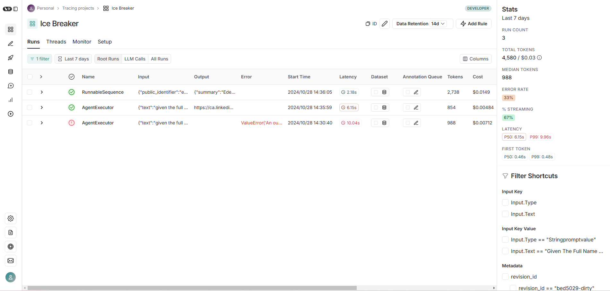
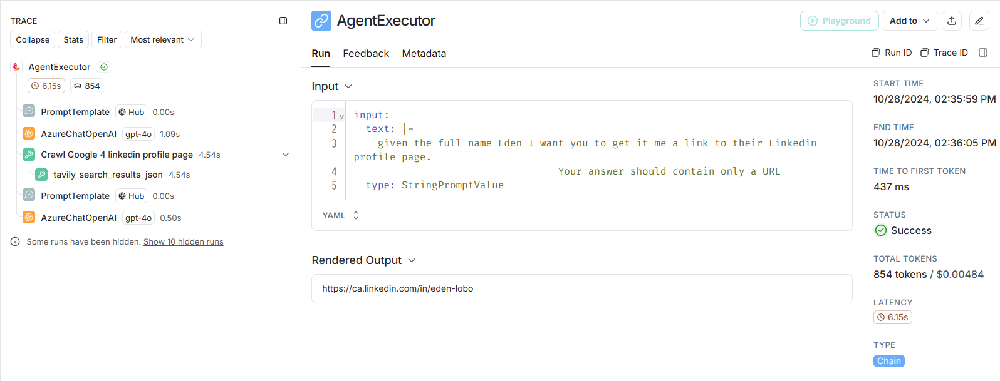

# Full-stacks App
このディレクトリでは、フロントエンドを構築する.  
また、構築したアプリケーションで使用したLLMの履歴をトレースする仕組みについて理解する.  


## 1.1. Flaskアプリ
[app.py](./app.py)を参照.  

ここで分かったことは、アプリケーションへのデータ送付も構造化データで行う点.  

バックエンドからフロントエンドへのデータは下記
```bash
summary="Eden Marco is a Customer Engineer at Google based in Tel Aviv, Israel. With a background in backend development, Eden is also a best-selling instructor on Udemy. He has experience working with various tech companies and holds a Bachelor's Degree in Computer Science from Technion - Israel Institute of Technology."   
facts=['Eden Marco has produced and published two best-selling courses on Udemy, with a total of over 9,000 enrolled students and a solid 4.7-star rating.', 'Before joining Google, Eden served as a Captain in the Israel Defense Forces and worked as a Software Engineer at companies like Orca Security, Wizer, and Deep Instinct.']
```

このデータをフロントエンドで下記のように処理する.  
```python
summary, profile_pic_url = ice_break_with(name=name)
    print(summary, profile_pic_url)
    return jsonify(
        {
            "summary_and_facts": summary.to_dict(),
            "picture_url": profile_pic_url,
        }
    )
```

なるほどなあ、勉強になる.  

## 1.2. アプリケーションの実行状況をトレースする(LangSmith)
アプリケーションの実行時には、バックエンドで以下のような情報が表示される.  

```bash
> Entering new AgentExecutor chain...
To find the Linkedin profile page for the full name "Eden," I will use the Crawl Google 4 linkedin profile page tool.

Action: Crawl Google 4 linkedin profile page
Action Input: "Eden"HTTPError('400 Client Error: Bad Request for url: https://api.tavily.com/search')It seems there was an error with the request. The name "Eden" might be too ambiguous or general. To improve the search, I should consider using a full name or additional details if available.

Final Answer: The name "Eden" is too general. Please provide a full name or additional details to narrow down the search for the Linkedin profile page.

> Finished chain.
```
しかし、フロントエンドこれらの情報が確認できないため、何が起こっているのか確認できない.  
そこで、これらの実行結果をトレースするために、[LangSmith](https://www.langchain.com/langsmith)を用いる.  

## 1.3. LangSmith  
1. アクセス(https://www.langchain.com/langsmith)
2. APIキー取得
3. envに設置  
    LANGCHAIN_API_KEY = XYZ
4. LangSmith Quick Guide 参照(https://docs.smith.langchain.com/old/tracing/quick_start)

ええええ、こんだけで勝手にLangSmithが、LangChainの使用歴をトレースしてくれる!?  
  

- AgentExecutor  
    呼び出したプロンプトを見ることが可能.  

  

分かる事(例)
- LLM API使用回数  
    ここでは、Azure OpenAI のAPIが合計２回呼ばれていることが分かる.  
- 回答に要した時間/トークン数  
    6.15 seconds  
    854 tokens

    
- Prompt内容
    - 指示文①
        ```txt
        human
        Answer the following questions as best you can. You have access to the following tools:

        Crawl Google 4 linkedin profile page(name: str) - useful for when you need get the Linkedin Page URL

        Use the following format:

        Question: the input question you must answer
        Thought: you should always think about what to do
        Action: the action to take, should be one of [Crawl Google 4 linkedin profile page]
        Action Input: the input to the action
        Observation: the result of the action
        ... (this Thought/Action/Action Input/Observation can repeat N times)
        Thought: I now know the final answer
        Final Answer: the final answer to the original input question

        Begin!

        Question: text='given the full name Eden I want you to get it me a link to their Linkedin profile page.\n                              Your answer should contain only a URL'
        Thought:
        ```
    - LLM回答①
        ```txt
        To find the LinkedIn profile page for someone named Eden, I will need to search for their LinkedIn profile using Google.

        Action: Crawl Google 4 linkedin profile page
        Action Input: "Eden linkedin profile"
        ```

    - 指示文②
        ```txt
        Answer the following questions as best you can. You have access to the following tools:

        Crawl Google 4 linkedin profile page(name: str) - useful for when you need get the Linkedin Page URL

        Use the following format:

        Question: the input question you must answer
        Thought: you should always think about what to do
        Action: the action to take, should be one of [Crawl Google 4 linkedin profile page]
        Action Input: the input to the action
        Observation: the result of the action
        ... (this Thought/Action/Action Input/Observation can repeat N times)
        Thought: I now know the final answer
        Final Answer: the final answer to the original input question

        Begin!

        Question: text='given the full name Eden I want you to get it me a link to their Linkedin profile page.\n                              Your answer should contain only a URL'
        Thought:To find the LinkedIn profile page for someone named Eden, I will need to search for their LinkedIn profile using Google.

        Action: Crawl Google 4 linkedin profile page
        Action Input: "Eden linkedin profile"

        Observation: [{'url': 'https://ca.linkedin.com/in/eden-lobo', 'content': "View Eden's full profile. I&#39;m a fourth-year BBA student with skills in collaboration and team leadership, driven by a curiosity that compels me to continuously learn and adapt to new environments. I&#39;m always happy to chat and learn more—let's connect! · Location: Greater Toronto Area, Canada · 130 connections on LinkedIn."}, {'url': 'https://www.linkedin.com/in/eden-ezell', 'content': "View Eden Ezell's profile on LinkedIn, a professional community of 1 billion members. In my heart, I'm a helper. Growing up with alopecia, my world view was shaped by being… · Experience"}, {'url': 'https://ca.linkedin.com/in/jleden', 'content': "View Jess Eden's profile on LinkedIn, a professional community of 1 billion members. Founder, Transformation Advisor & Coach · An innovator, coach and transformation advisor with over 20 years of experience. Seasoned in leading people and organizations to achieve the mindsets and behaviours required to thrive. <br><br>Available for"}, {'url': 'https://ca.linkedin.com/in/eden-granovsky', 'content': "Experience: Accenture · Location: Toronto · 500+ connections on LinkedIn. View Eden Granovsky's profile on LinkedIn, a professional community of 1 billion members."}, {'url': 'https://uk.linkedin.com/in/edenpujol', 'content': "Welcome back. LBS MFA | ESSEC graduate · Experience: Goldman Sachs · Education: London Business School · Location: London Area, United Kingdom · 500+ connections on LinkedIn. View Eden Pujol's profile on LinkedIn, a professional community of 1 billion members."}]
        Thought: 

    - LLM回答②
        ```txt
        Final Answer: https://ca.linkedin.com/in/eden-lobo
        ```