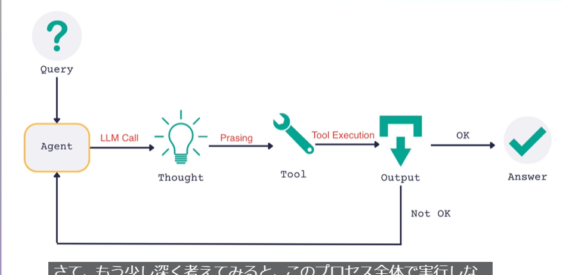

# ReAct Agents  
このセクションでは、前回の勉強で示していたReAct Agentに関して、自分自身で実装して意味合いを確認する.  


## Agent Executorとは
シンプルに言うと、Whileループの事.  
ユーザーの入力（プロンプト）を受け取り、LLMが自由に使えるようにツールに関する全ての情報でそれらを補強して、LLMに送信する.  
LLMの回答に答えが含まれていなかったら、この質問を投げかけ続ける.  


偽のAgent Executorの実装
```python  
Class FakeAgentExecutor:
    def invoke(self, input):
        while True:
            result = self.agent(input)
            if result == 'RunTool':
                tool_to_run(tool_input)
            else:
                return result
```



- エージェントに問い合わせ
- 必要なツールを考える  
- ツールを使ってみる  
- 必要な情報が得られているか判断.  

## Code

### 1.1. Set up
```bash 
pip install langchain langchain-openai black python-dotenv
```

### 1.2. make a tool
```python
from langchain.tools import Tool, tool
@tool
def get_text_length(text: str) -> int:
    """Returns the length of a text by characters"""
    print(f"get_text_length enter with {text=}")
    text = text.strip("'\n").strip(
        '"'
    )  # stripping away non alphabetic characters just in case

    return len(text)
```

「@tool」を記載する事で、この関数がLangChainによって、Agentの用いることが可能なToolになる.(https://python.langchain.com/docs/how_to/custom_tools/)  

- name: get_text_length
- description: Returns the length of a text by characters  
    ※この時「\n」や「.」は、llmに不要なテキストとして渡されるため、記載しない.  

### 1.3. make a prompt
[langchain hub](https://smith.langchain.com/hub?organizationId=2b9e227f-4519-430f-89d1-fbfdda893913)で、必要なプロンプトを検索.  
今回は、ReAct Agentで最も用いられている「hwchase17」を用いる.  

原文
```python
Answer the following questions as best you can. You have access to the following tools:

{tools}

Use the following format:

Question: the input question you must answer
Thought: you should always think about what to do
Action: the action to take, should be one of [{tool_names}]
Action Input: the input to the action
Observation: the result of the action
... (this Thought/Action/Action Input/Observation can repeat N times)
Thought: I now know the final answer
Final Answer: the final answer to the original input question

Begin!

Question: {input}
Thought:
```
日本語訳
```python
以下の質問にできる限り答えてください。利用可能なツールは次の通りです：

{tools}

次の形式を使用してください：

質問: あなたが答えるべき入力質問 
考え: 何をすべきかを常に考える 
アクション: 取るべきアクション、次の中の1つ [{tool_names}] 
アクション入力: アクションへの入力 
観察: アクションの結果 ...（この「考え」「アクション」「アクション入力」「観察」がN回繰り返されることがあります） 
考え: 最終的な答えが分かった 

最終的な答え: 元の入力質問に対する最終的な答え

始めましょう！

質問: {input} 考え:

```

```python
prompt = PromptTemplate.from_template(template=template).partial(
        tools=render_text_description(tools),
        tool_names=", ".join([t.name for t in tools]),
    )
    
```

- tools:  
    render_text_description関数によって、ツールの名前と説明を文字列として返している.  

```python
llm = ChatOpenAI(temperature=0, stop = ["\nObservation", "Observation"])
```

- temperature:  
    クリエイティブな回答か(1>0)

- stop:  
    "\n"が確認されたら生成を辞める.  


### 1.4.  ReAct Agent  

```python
agent = (
        {
            "input": lambda x: x["input"],
        }
        | prompt
        | llm
        | ReActSingleInputOutputParser()
    )

res = agent.invoke({"input":"What is the length of 'DOG' in characters"})
```

- [LCEL (LangChain Exxpression Language)](https://python.langchain.com/v0.1/docs/expression_language/)  
    この奇妙な書き方は、LangChain式の言語記法.  
    メリットは、コンポーネント化しているためそれぞれのステップで何が起きているかを正確に理解する事が出来る点.  
    直観的に左の出力が、右に流れ込んでいることを理解できる.  

    
    > 「Input -> Prompt作成 -> LLMに入力 -> ReActSingleInputOutputPerserに入力」  

- LLMの結果を確認  
    ```python
    content="I need to determine the length of the text 'DOG' in characters.\n\n
    Action: get_text_length\n
    Action Input: 'DOG'" 
    additional_kwargs={'refusal': None} 
    response_metadata={'token_usage': {'completion_tokens': 27, 'prompt_tokens': 173, 'total_tokens': 200, 'completion_tokens_details': None, 'prompt_tokens_details': None}, 'model_name': 'gpt-4o-2024-05-13', 'system_fingerprint': 'fp_67802d9a6d', 'prompt_filter_results': [{'prompt_index': 0, 'content_filter_results': {'hate': {'filtered': False, 'severity': 'safe'}, 'jailbreak': {'filtered': False, 'detected': False}, 'self_harm': {'filtered': False, 'severity': 'safe'}, 'sexual': {'filtered': False, 'severity': 'safe'}, 'violence': {'filtered': False, 'severity': 'safe'}}}], 'finish_reason': 'stop', 'logprobs': None, 'content_filter_results': {'hate': {'filtered': False, 'severity': 'safe'}, 'self_harm': {'filtered': False, 'severity': 'safe'}, 'sexual': {'filtered': False, 'severity': 'safe'}, 'violence': {'filtered': False, 'severity': 'safe'}}} id='run-41af33d8-6a69-499e-8e94-b4ffb11db35f-0' 
    usage_metadata={'input_tokens': 173, 'output_tokens': 27, 'total_tokens': 200, 'input_token_details': {}, 'output_token_details': {}}
    ```

    この結果より、使うべきツールは「get_text_length」、関数に入れる文字は「DOG」である.   
    という風にLLMが解釈していることが分かる.  

- ReActSingleInputOutputParser  
    この関数は、「Action」と「Action Input」という返答が来ることを想定されている.  
    もし、指定の返答以外の場合にはエラーが発生してしまう.  

### 1.4.1 How to choose the tools by LLM([callbacks.py]())
LLMは使うべきツールをどのように判断して、答えの真偽をどうやって判断しているのかについてのロジックについて説明.  
なぜ、このプロンプトで正確に動作しているのかを知る必要がある.   
 参考：https://python.langchain.com/v0.1/docs/modules/callbacks/

LangChainのCallbackロジックをLLMの初期設定にいれることで、LLMが動作する全てのタイミングにおいて実行される.  


```python 
class AgentCallbackHandler(BaseCallbackHandler):
    def on_llm_start(
        self, serialized: Dict[str, Any], prompts: List[str], **kwargs: Any
    ) -> Any:
        """Run when LLM starts running."""
        print(f"***Prompt to LLM was:***\n{prompts[0]}")
        print("*********")

    def on_llm_end(self, response: LLMResult, **kwargs: Any) -> Any:
        """Run when LLM ends running."""
        print(f"***LLM Response:***\n{response.generations[0][0].text}")
        print("*********")

llm = AzureChatOpenAI(
        temperature=0, stop = ["\nObservation", "Observation"], callbacks = [AgentCallbackHandler]
    )

```
このcallbacksを組み込むことで、LLMの思考を以下のように読み取る事が出来る.  

```bash 
Hello ReAct LangChain!
***Prompt to LLM was:***
Human: 
    Answer the following questions as best you can. You have access to the following tools:

    get_text_length(text: str) -> int - Returns the length of a text by characters
    
    Use the following format:
    
    Question: the input question you must answer
    Thought: you should always think about what to do
    Action: the action to take, should be one of [get_text_length]
    Action Input: the input to the action
    Observation: the result of the action
    ... (this Thought/Action/Action Input/Observation can repeat N times)
    Thought: I now know the final answer
    Final Answer: the final answer to the original input question
    
    Begin!
    
    Question: What is the length of the word: DOG
    Thought: 
    
*********
***LLM Response:***
The length of the word "DOG" can be determined by counting the number of characters in it.
Action: get_text_length
Action Input: "DOG"
*********
tool='get_text_length' tool_input='DOG' log='The length of the word "DOG" can be determined by counting the number of characters in it.\nAction: get_text_length\nAction Input: "DOG"'
get_text_length enter with text='DOG'
observation=3
***Prompt to LLM was:***
Human: 
    Answer the following questions as best you can. You have access to the following tools:

    get_text_length(text: str) -> int - Returns the length of a text by characters
    
    Use the following format:
    
    Question: the input question you must answer
    Thought: you should always think about what to do
    Action: the action to take, should be one of [get_text_length]
    Action Input: the input to the action
    Observation: the result of the action
    ... (this Thought/Action/Action Input/Observation can repeat N times)
    Thought: I now know the final answer
    Final Answer: the final answer to the original input question
    
    Begin!
    
    Question: What is the length of the word: DOG
    Thought: The length of the word "DOG" can be determined by counting the number of characters in it.
Action: get_text_length
Action Input: "DOG"
Observation: 3
Thought: 
    
*********
***LLM Response:***
I now know the final answer.
Final Answer: The length of the word "DOG" is 3 characters.
*********
return_values={'output': 'The length of the word "DOG" is 3 characters.'} log='I now know the final answer.\nFinal Answer: The length of the word "DOG" is 3 characters.'
### AgentFinish ###
{'output': 'The length of the word "DOG" is 3 characters.'}
```

この時、ReAct Agentが、なぜ思考の停止を出来るのかの鍵は、「stop = ["\nObservation", "Observation"]」にある. LLMは、Observationという単語が出てきた時点で、思考を停止する.  
それによって、必要なアクションの情報のみで思考を停止する事が出来るのだ.  


ここまでで、実行する関数の選択は決まった.  
関数を選択するロジックは、[Les2-2]

### 1.5. Tool Executor

```python
def find_tool_by_name(tools: List[Tool], tool_name: str) -> Tool:
    for tool in tools:
        if tool.name == tool_name:
            return tool
    raise ValueError(f"Tool wtih name {tool_name} not found")

agent_step: Union[AgentAction, AgentFinish] = agent.invoke(
    {
        "input": "What is the length of 'DOG' in characters?",
    }
)
print(agent_step)

if isinstance(agent_step, AgentAction):
    tool_name = agent_step.tool
    tool_to_use = find_tool_by_name(tools, tool_name)
    tool_input = agent_step.tool_input

    observation = tool_to_use.func(str(tool_input))
    print(f"{observation=}")
```
- find_tool_by_name  
    LLMからの返答の中に含まれる関数が、Toolの中に存在するか確認する処理を記載している

結果
```bash
tool='get_text_length' tool_input="'DOG'" log="I need to determine the length of the text 'DOG' in characters.\n\nAction: get_text_length\nAction Input: 'DOG'"
get_text_length enter with text="'DOG'"
observation=3
```

この時点で、  
1. LLMは回答を生成するか
2. 思考を繰り返すか  
を判断する（Loop）

### 1.6. ReAct Loop
Prompt内  
```python
Prompt = """~~~
Begin!
    
Question: {input}
Thought: {agent_scratchpad}
"""
```

- agent_scratchpad  
    この中に、ReActの実行でこれまでに得たすべての履歴と全ての情報が含まれることになる.  

```python
intermediate_steps = []
format_log_to_str
agent_step: Union[AgentAction, AgentFinish] = agent.invoke(
    {
        "input": "What is the length of the word: DOG",
        "agent_scratchpad": lambda x: format_log_to_str(x["agent_scratchpad"]),
    }
)

print(agent_step)
if isinstance(agent_step, AgentAction):
    tool_name = agent_step.tool
    tool_to_use = find_tool_by_name(tools, tool_name)
    tool_input = agent_step.tool_input
    observation = tool_to_use.func(str(tool_input))
    print(f"{observation=}")
    intermediate_steps.append((agent_step, str(observation)))
```

- intermediate_steps  
    中間ステップ。履歴を保持する中間ステップとしての役割.  

- format_log_to_str
    この関数では、LOG（Agentが決定した事、どのツールを使うのか、ツールの結果）を中間ステップ分けて受け取る.  
    そして、これらのログを全て文字列に上手くフォーマットしてくれる.  

- agent_step  
    "log='I now know the final answer.\n\nFinal Answer: The length of the word "DOG" is 3 characters.'"  
    この出力が出た時に、出力パーサーは最終的な回答を得たと判断する.  