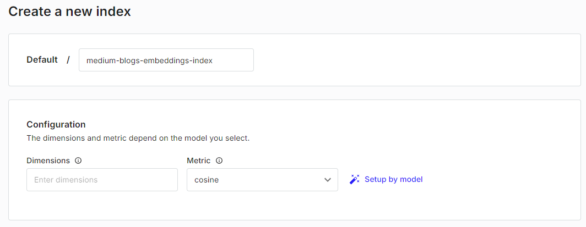
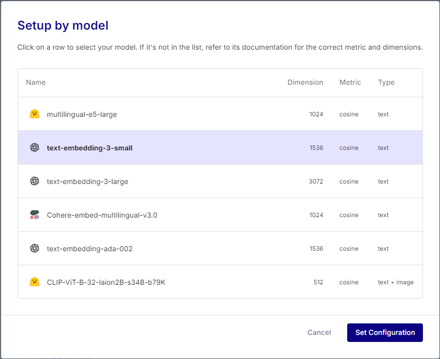
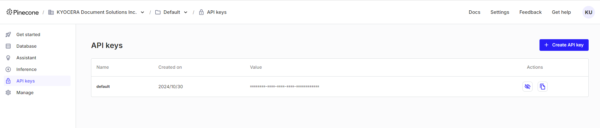
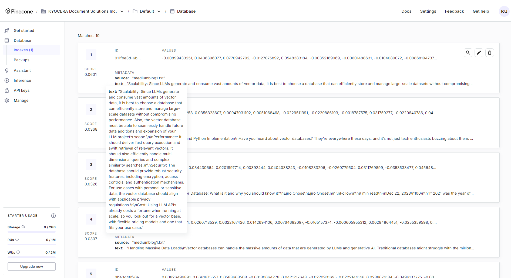

# Text to vector dbs
今回はmediumブログをベクター変換し、ベクターストア(pinecorn)に保存する.  

## 概要
1. メディアインポート
2. LangChain Splitterでテキストを小さなチャンクに分割.  
3. それらのチャンクを埋め込んでベクターに変換.  
4. そのベクターをpineconeのベクターストアに保存する.  


### 1. メディアインポート
- LangChain Document Loader  
    [Document Loader](https://python.langchain.com/v0.1/docs/modules/data_connection/document_loaders/)は、LLMでドキュメントの内容を消化できるように、データロードして処理する方法をクラスで実装したもの.  
    Document Loaderは、そんなに難しいことはしていない.ただファイルを開いて、読み込んでいるだけ([LINK](https://github.com/langchain-ai/langchain/tree/master/libs/langchain/langchain/document_loaders))

    ここでいいのは、インターフェースは同一で様々なファイルのロードが可能な点.  
    loaderの中には、ソースが含まれており、RAGを使う時に何処からその情報を得たのかの根拠づけに使える.  
    ```python
    print("Ingesting...")
    loader = TextLoader("/Users/edenmarco/Desktop/intro-to-vector-dbs/mediumblog1.txt")
    document = loader.load()
    ```

### 2. チャンク分割
- Text Splitters
    [text splitters](https://python.langchain.com/v0.1/docs/modules/data_connection/document_transformers/)は、長いテキストのトークンを適切なチャンクサイズに分割する事が出来る. 子のロジックはモデルによって異なる.  
    - overlap  
        文脈や意味を乱すような形でのチャンク分割を防ぐ
    - length  
        LangChainがチャンクサイズを決定するために役立つ.  

    ```python
    print("splitting...")
    text_splitter = CharacterTextSplitter(chunk_size=1000, chunk_overlap=0)
    texts = text_splitter.split_documents(document)
    print(f"created {len(texts)} chunks")
    ```
    - chunk_size  
        チャンクサイズは、経験則だが、人間が理解できる情報量が含まれているコンテキスト料を設定する.  
    - chunk_overlab  
        0: 全てのチャンクに重なりが無い情報を持つ状態を指す.  


### 3. エンベディングモデルでベクター化
- Text Embedding model  
    [text embedding model](https://python.langchain.com/v0.1/docs/modules/data_connection/text_embedding/)は、モデルごとのインターフェースをラップしてくれている.  

    ```python
    embeddings = AzureOpenAIEmbeddings(
        model = os.getenv('MODEL_NAME'),
        azure_endpoint = os.getenv('API_BASE'),
        api_key= os.getenv('API_KEY'),
        openai_api_version= os.getenv('API_VERSION')
    )

    print("ingesting...")
    PineconeVectorStore.from_documents(texts, embeddings, index_name=os.environ['INDEX_NAME'])
    print("finish")
    ```

### 4. Pineconeでベクターを保存する
- Pinecorn
    [Pinecorn](https://www.pinecone.io/)は、現在人気のあるベクターストアの管理ツール。


-  setup
    

    - Defaul/[~~~] : 好きな名前
    - Dimentions / Metrics : 保存するベクターのサイズとそれらの距離をどのような指標で計算するのかを指定する
    - setup by model : 今回は「OpenAI embedding small」を選択. modelを決定すると、自動でDimentionsもきまる.  
    

    - APIキーを取得して、envファイルに設置.  
    
    


    ※上記のツールは、クラウド(AWS, GCP, Azure)に結び付けることも可能.  

- 実行後  
    
    実行後には、チャンク分割後のベクターデータがPinecornに保存される.  
    

## Code
### 1.1. Setup

```bash
pip install langchain langchain-openai langchain-pinecone python-dotenv langchianhub black
```

- 検索したいドキュメントの用意  
[mediumblog1.txt](./mediumblog1.txt)のように、サイトのテキストを用意.  
