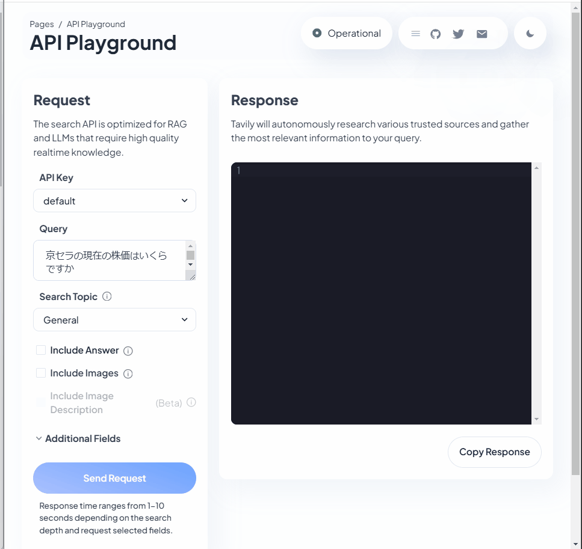

Udemy part 3 to 5
# Topic about LangChain & LLM
LLMは、世界中のあらゆるデータにアクセスできるスーパーパワーを備えている。  
LangChainは、これらの世界中のデータを繋ぐための強力なフレームワークである。  

LangChainに接続したLLMは、ユーザーの要望に対して最適な外部APIやデータベースの検索を実施する(Agent)。  

## 1. Agent
### 1.1. Agentの仕組み
これらのAgentは、思考の連鎖とREACTによって実現している。（詳細は、後）  

    + 思考の連鎖  
        接続した外部データに対して、ユーザーの要望に答える情報を検索する技術
    
    + REACT
        外部データへの検索完了すれば、それらの推論結果を返す技術

### 1.2.参考:  
    - [Udemy](https://kyocerajp.udemy.com/course/langchain/learn/lecture/37499504#overview)
    - [LangChain公式 Agents](https://python.langchain.com/docs/how_to/#agents)

## 2. create Agent (LLM can use tool with searching Linkedin URL)
### 2.1. このAgentの概要と目的
このエージェントの目的は、  
> オンライン検索の入力として名前を取得し、その名前のLinkedInのURLを取得できるようにする事

LinkedInのスクレイピング部分は, [Les2](../Les2-Thirdparties-agent/)で実装した通り.  
今回はオンラインで名前を検索し、正しいLinkedInのURLを見つける部分を構築する.  
そのために、今回はLangChain REACT Agentを活用する.  

### 2.2. agents/linkedin_lookup_agent.py

#### 2.2.1. ライブラリ
```python
from langchain_core.tools import Tool
from langchain import hub
from langchain.agents import (
    create_react_agent,
    AgentExecutor,
)
```
- tools
    LLMが外部の情報を取得する場合に、ツールはこれらの情報を持つオブジェクトの事
    このツールがLLMのオンライン検索を可能にする  

    description：LLMがこのツールを使う際に参考にする説明文
    func：Python関数として呼び出し可能にするオプション

- hub  
    コミュニティで事前に作られたプロンプトをダウンロードする  
    
- create_react_agent(REACT)  
    入力：Agentのパワーとなるリソース(LLM、ツール、プロンプト、リアクトプロンプト)を受け取る。  
    出力：REACTアルゴリズムに合わせた形式で返す。  

- AgentExecutor  
    プロンプトや指示を受け取るオブジェクト

#### 2.2.2. Code
```python
tools_for_agent = [
        Tool(
            name="Crawl Google 4 linkedin profile page",
            func=get_profile_url_tavily,
            description="useful for when you need get the Linkedin Page URL",
        )
    ] 
```

- name  
    このツールの名前。第三者が見ても分かるような意味のある名前を付ける.  

- func  
    実際にこのツールに実行させたいPython関数を指定.  

- description  
    ★★LLMがこのツールを使用するかどうか決定する方法である.  
    Toolの中で最も重要な要素である.  
    出来る限り簡潔で、出来る限り多くの情報を持たせる必要がある.  

```python
react_prompt = hub.pull("hwchase17/react")
agent = create_react_agent(llm=llm, tools=tools_for_agent, prompt=react_prompt)
agent_executor = AgentExecutor(agent=agent, tools=tools_for_agent, verbose=True)
```

- hwchase17/react  
    ハリソン・チェイスさんはLangChainとREACTの共同創設者の命名.  
    [このプロンプト](https://smith.langchain.com/hub/hwchase17/react)は、REACTプロンプトに使われる超人気プロンプトである.  
    このようにLangChain hubには、私たちのユースケースに合わせたプロンプト開発者が多く存在する.  

- agent
    このエージェントは、基本的にLLMがどのように通信するか  
    どのようなツールを使うのか、そして得られた出力をどのように解析するのかという事を全て保持している.  

- agent executor
    これらの全てを設定・自動化し、実際にPython関数を呼び出す責任をおうことになるオブジェクト.  

### 2.3. tools/tools.py
このツールの目的は、名前を取得して、LinkedInのURLを見つけるコト

そのために、今回は「[TavilySearchResults](https://js.langchain.com/docs/integrations/tools/tavily_search/)」というサードパーティーアプリを作る.  

- Tavilyは、生成AIの作業に最適化された検索API  
    Google等の検索ツールを用いるより、より良い作業ができる.  
    [こちら](https://app.tavily.com/home)から、APIを取得する.  
    

    LLMは、このAPIからのレスポンスをすべて取得し、ユーザーに取って必要な情報のみを提供可能である.  


### 2.4. 実行結果
```bash
/home/kosuke-usui/code/langchain-content/venv/lib/python3.12/site-packages/langsmith/client.py:354: LangSmithMissingAPIKeyWarning: API key must be provided when using hosted LangSmith API
  warnings.warn(


> Entering new AgentExecutor chain...
To find the LinkedIn profile page for Eden Marco, I will perform a search using the provided name.

Action: Crawl Google 4 linkedin profile page
Action Input: "Eden Marco Udemy"[{'url': 'https://github.com/emarco177/', 'content': "in/eden-marco @EdenEmarco177; Achievements. x2. Achievements. x2. Block or Report. Block or report emarco177 ... I'm Eden! 👋 . 👨\u200d💻 Backend ... GenAI LangChain Course (Python) Demo | Udemy Link. Created a Full Stack AI course with 60000+ students, 10000+ reviews. Using LangChain, Streamlit, HTML, CSS, JavaScript and Pinecone"}, {'url': 'https://www.reddit.com/r/LangChain/comments/1bgsok2/how_to_start_learning_langchain/', 'content': 'Eden Marco Udemy is a great start. He has active discord community as well. He is a great dude. Reply reply StickyEchidna • Just go on the official docs for langchain, it literally shows you exactly what code you need and gives you options to use OpenAI API or a locally hosted Ollama.'}, {'url': 'https://www.udemy.com/user/eden-marco/', 'content': 'I have always been a fan of teaching and mentorship and I am teaching CS courses (Functional Programming and Introduction to CS) at Reichman University, Israel. Eden Marco | LLM Specialist is a Udemy instructor with educational courses available for enrollment. Check out the latest courses taught by Eden Marco | LLM Specialist.'}, {'url': 'https://www.linkedin.com/today/author/eden-marco', 'content': 'Check out professional insights posted by Eden Marco, LLMs @ Google Cloud | Best-selling Udemy Instructor | Backend &amp; GenAI | Opinions stated here are my own, not those of my company'}, {'url': 'https://www.youtube.com/watch?v=9k-oF9g9FTk', 'content': 'Join us as we sit down with Eden Marco who is an instructor at @udemy an expert in LLM and AI ecosystems, for an enlightening conversation about the fascina'}]Final Answer: https://www.linkedin.com/today/author/eden-marco

> Finished chain.
https://www.linkedin.com/today/author/eden-marco
```

- もし違う人のLinkedIn URLが出てくるなら？  
    これは、Inputの情報を増やす(Eden Marco -> Eden Marco Udemy etc.)


## 参考
- 思考の連鎖：https://arxiv.org/pdf/2201.11903v1
- REACT：https://arxiv.org/pdf/2210.03629

- LLMからの出力をJson形式にできる  
    [LangChain Output parser](https://python.langchain.com/docs/how_to/#agents)  
    [関連記事](https://chmod774.com/langchain-output-parser/)  

- REACTの人気プロンプト: [hwchase17/react](https://smith.langchain.com/hub/hwchase17/react)