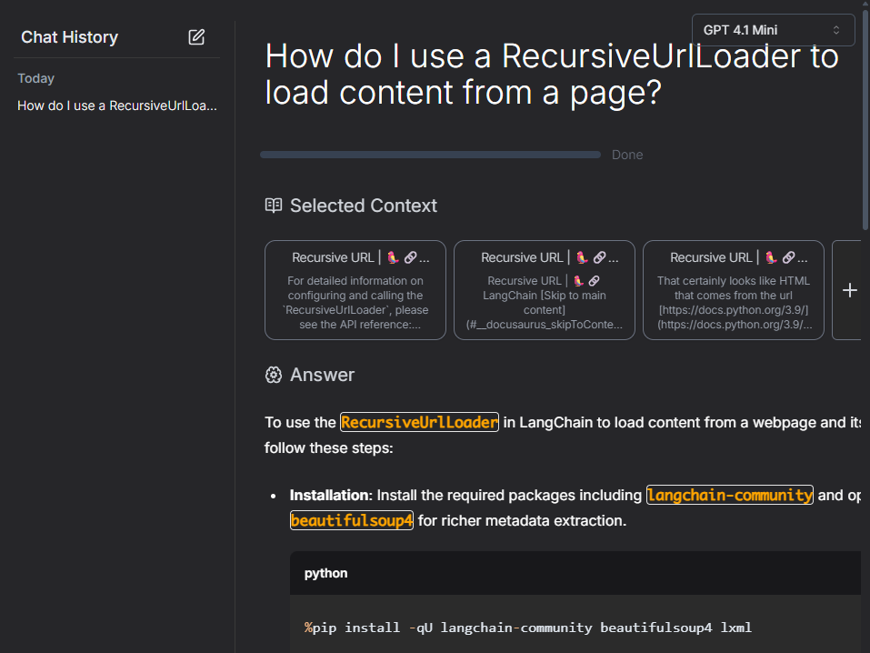

# Building a Document Assistant Apps
このセクションでは、ドキュメントアシストのアプリケーションを０から作成していく.  

作成目標：https://github.com/emarco177/documentation-helper/tree/main

##  概要
以下の内容を扱う.  
1. Vector Databases (Ingestion)
2. RetrieveQA chain (RAG)
3. Similarity Search
4. LLM Memory
5. Streamlit

## Lectures
### 0. Environment Setup  
1. Download about LangChain Document
    今回Documentの対象は、[このサイト](https://python.langchain.com/v0.1/docs/expression_language/get_started/).  
    [Download Data](./langchain-docs/)

    これらのサイトをダウンロードしただけのデータには、ゴミ（HTMLタグやその他）がたくさん含まれている. しかし、これらのゴミをLLMに送信する際に処理する必要はない.  
    なぜならこれらのごみを含む情報を全て、LLMが処理してくれるからだ.  

2. Pinecorn  
    [こちら](https://www.pinecone.io/)でログイン⇒新規Indexを作成⇒envファイルにAPIキーを設置  

3. 必要なライブラリをインストール  
    ```bash
    python -m venv venv
    source venv/bin/activate
    pipenv install
    ```
    参考：https://qiita.com/tamazoo/items/9fc0dfda3c583583c402  

### 1. Vector Databases (Ingestion) -> ingestion.py  


1. ライブラリ  
    ```python
    from langchain.text_splitter import RecursiveCharacterTextSplitter
    from langchain_community.document_loaders import ReadTheDocsLoader
    from langchain_openai import OpenAIEmbeddings
    from langchain_pinecone import PineconeVectorStore
    ```

    - [ReadTheDocsLoader](https://python.langchain.com/api_reference/community/document_loaders/langchain_community.document_loaders.readthedocs.ReadTheDocsLoader.html)  
        Read the Docsは、GitHubリポジトリのドキュメント作成を支援するツール. langchainでは、このドキュメントをロードする仕組みをReadtheDocsLoaderとして提供している.  

2. Contents
    ```python
    def ingest_docs():
        ### Docs Loading
        loader = ReadTheDocsLoader("langchain-docs/langchain.readthedocs.io/en/v0.1")
        raw_documents = loader.load()
        print(f"loaded {len(raw_documents)} documents")

        ### chunking split
        text_splitter = RecursiveCharacterTextSplitter(chunk_size=600, chunk_overlap=50)
        documents = text_splitter.split_documents(raw_documents)
        for doc in documents:
            new_url = doc.metadata["source"]
            new_url = new_url.replace("langchain-docs", "https:/")
            doc.metadata.update({"source": new_url})


        ### Save to Pinecorn
        print(f"Going to add {len(documents)} to Pinecone")
        PineconeVectorStore.from_documents(
            documents, embeddings, index_name="langchain-doc-index"
        )
        print("****Loading to vectorstore done ***")
    ```

    - LOAD
        ```python
        ### Docs Loading
        loader = ReadTheDocsLoader("")
        ```

    - SPLIT
        ```python
        ### chunking split
        text_splitter = RecursiveCharacterTextSplitter(chunk_size=600, chunk_overlap=50)
        ```  
        テキスト分割を行う関数. LLMには、ユーザーの質問と、このテキストチャンクを追加したコンテキストを送信する.  

    
        チャンクとは、簡潔に言うとドキュメントを小分けにすること。プロンプトでLLMに送信するテキストとチャンクコンテキストを追加させて回答させる必要がある。  
        この時、短く簡潔な答えが必要な場合には、チャンクサイズは小さい方が良い. しかし、チャンクサイズが極端に小さくなると意味を持たなくなるので、避けた方が良い.  

    
    - チャンク(ドキュメント)ごとに新規URLを設定  
        ```python
        for doc in documents:
            new_url = doc.metadata["source"]
            new_url = new_url.replace("langchain-docs", "https:/")
            doc.metadata.update({"source": new_url})
        ```

        これによってこのドキュメントが何処から来たのか、完全なURLを教えてくれる.  

    - SAVE
        ```python
        PineconeVectorStore.from_documents(
        documents, embeddings, index_name=os.environ['INDEX_NAME']
        )
        ```
        pineconeに保存

3. 補足：VertexAIのエンベディングモデルについて  
    [こちら](https://cloud.google.com/vertex-ai/generative-ai/docs/model-reference/text-embeddings-api?hl=ja#python)に現在使えるエンベディングモデルの記載がある。

    また、ディメンションは、1~768の範囲で選択できるとのこと。  
    https://cloud.google.com/vertex-ai/generative-ai/docs/embeddings/get-text-embeddings?hl=ja

#### Trouble shootings
    1. エンベディングモデルのレート制限を超過
        - エラー内容  
            ```python
            openai.RateLimitError: Error code: 429 - {'error': {'code': '429', 'message': 'Requests to the Embeddings_Create Operation under Azure OpenAI API version 2024-08-01-preview have exceeded call rate limit of your current OpenAI S0 pricing tier. Please retry after 86400 seconds. Please go here: https://aka.ms/oai/quotaincrease if you would like to further increase the default rate limit.'}}
            ```

        - 解決方法  
            ①APIのレートティアを上げる.  
            ②分割してベクトル化.  
            ③別のエンベディングモデルを使用（今回はこちらを採用）

    2. Pineconeのディメンションが異なる.  
        - エラー内容  
            ```bash
            pinecone.core.client.exceptions.PineconeApiException: (400)
            Reason: Bad Request
            HTTP response headers: HTTPHeaderDict({'Date': 'Fri, 01 Nov 2024 03:15:09 GMT', 'Content-Type': 'application/json', 'Content-Length': '103', 'Connection': 'keep-alive', 'x-pinecone-request-latency-ms': '902', 'x-pinecone-request-id': '9069753074993681914', 'x-envoy-upstream-service-time': '48', 'server': 'envoy'})
            HTTP response body: {"code":3,"message":"Vector dimension 768 does not match the dimension of the index 1536","details":[]}
            ```

        - 解決方法  
            Pineconeの作成したIndexのディメンションサイズを、エンベディングモデルに合わせて瀬ってする必要がある.  
            参考：[LINK](https://medium.com/@nunocarvalhodossantos/i-tried-pinecone-and-this-was-what-happened-a-guide-through-console-and-python-code-cf668b3d273b)

    3. PineConeへのAPIリクエストの制限  
        ```bash
        HTTP response body: {"code":11,"message":"Error, message length too large: found 4553761 bytes, the limit is: 4194304 bytes","details":[]}
        ```

        バッチ処理を追加
        ```python
        # バッチサイズを設定
    batch_size = 500
    total_batches = (len(documents) + batch_size - 1) // batch_size
    
    # バッチ処理
    for i in range(0, len(documents), batch_size):
        batch = documents[i:i+batch_size]
        print(f"Processing batch {i//batch_size + 1}/{total_batches} ({len(batch)} documents)")
        
        # バッチごとにPineconeに保存
        PineconeVectorStore.from_documents(
            batch, embeddings, index_name=os.environ['INDEX_NAME']
        )
        
        print(f"Batch {i//batch_size + 1}/{total_batches} completed")
    ```


### 2. RetrieveQA chain (RAG) ->backend/core.py
質問に関連する文章を取得し、検索された文章で質問を補強し回答を生成する.  


1. ライブラリ  
    ```python
    from dotenv import load_dotenv
    from langchain.chains.retrieval import create_retrieval_chain
    from langchain import hub
    from langchain.chains.combine_documents import create_stuff_documents_chain
    from langchain_pinecone import PineconeVectorStore
    from langchain_openai import ChatOpenAI, OpenAIEmbeddings
    ```

    - create_retrieval_chain  
        関連する文章を取得する機能を実装したオブジェクト. このチェーンは質問文と関連するドキュメントを同時にLLMに送信する事が出来る.  

    - create_stuff_documents_chain  
        コンテキストをプロンプトに差し込む処理をする.  

    - プロンプト  
        ```python
        retrieval_qa_chat_prompt = hub.pull("langchain-ai/retrieval-qa-chat")
        ```

        https://smith.langchain.com/hub/langchain-ai/retrieval-qa-chat  
        こちらのプロンプトを使う。

        ```python
        Answer any use questions based solely on the context below:

        <context>
        {context}
        </context>
        ```
        シンプルですね。

    - combine_docs_chain  
        この変数では、最適化を行ったり関連するドキュメントを文字列にまとめたり、ドキュメントチェーンの全てのを担う意味がある。

    - result  
        この中には、メタデータが含まれており、関連するドキュメントを参照可能
        そこで、このメタデータをディクショナリーとして、作成する
        ```python
        new_result = {
            "query": result["input"],
            "result": result["answer"],
            "source_documents": result["context"],
        }
        ```

    

### 3. UI作成 ---> main.py
    Streamlitを用いる。

    - 実行コマンド
        ```bash
        streamlit run main.py
        ```

        それぞれのドキュメントが情報ソースを持っており、以下のように取得可能である
        ```python
            sources = set(
            [doc.metadata["source"] for doc in generated_response["source_documents"]]
        )
        ```

    - セッションについて
        セッションは、チャットするたびに変数を保管するために用いる。  

    - セッションをつかって会話履歴を保管する  
        - "user_prompt_history"  
            ユーザーの質問  
        - "chat_answers_history"  
            LLMの回答  

        - セッションが空でない場合  
            ```python
            if st.session_state["chat_answers_history"]:
                for generated_response, user_query in zip(
                    st.session_state["chat_answers_history"],
                    st.session_state["user_prompt_history"],
                ):
                    st.chat_message("user").write(user_query)
                    st.chat_message("assistant").write(generated_response)
            ```

    - Memory(チャットの会話履歴を保持・会話する) 
        やりたい事はユーザーの質問とその履歴に基づいて、質問を新しい独立した質問に言い換えるコト
        - `chat_history`セッション  
            これらに質問とLLMの回答を多プル形式で保存する

        - プロンプト   
            過去の履歴に基づいて、回答を生成するには以下のプロンプトが有効。  

            [langchain-ai/chat-langchain-rephrase](https://smith.langchain.com/hub/langchain-ai/chat-langchain-rephrase?organizationId=29145c9a-1c18-5dfb-b080-51b3780eb8d8)  

            これにより、ユーザーの履歴と質問をLLMが言い換えて出力してくれる。

        - create_history_aware_retriever  
            履歴があれば、それまでの履歴を含めて質問をリフレーズしてくれ、新しい質問が返ってくる。  
            履歴が無ければ、ユーザーの通常の質問を送っているだけになる。
            以下の質問応答のリトリーバーを変更する。  

            ```python
            qa = create_retrieval_chain(
                retriever=docsearch.as_retriever(), combine_docs_chain=stuff_documents_chain
            )
            ```

- Production UI  
    Generative UIという分野で、生成AIアプリケーションで作成したコンテンツをすばらしいUXで提供する。
      

    この中で、[chat-langchain](https://github.com/langchain-ai/chat-langchain)は優れたUIを持っている.  
    
        
## 補足
    ウェブサイトのLLMへのインプットに最適化した形に提供してくれるサービスとして、`FireCrawl`がある。  
    https://www.firecrawl.dev/

    ingestion.pyを差し替え可能